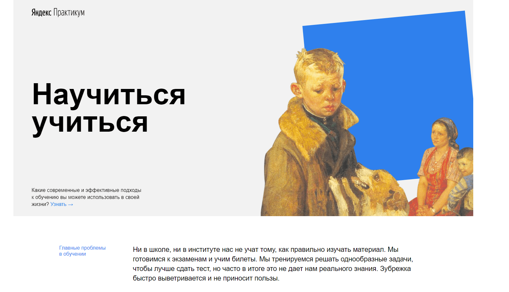

# Сайт "Научиться - учиться!"
> Сайт на основе современных технологий, HTML & CSS

[![HTML Version][html-image]][html-url]
[![CSS Version][css-image]][css-url]

При создании этой страницы, были использованы такие методалогии как:
BEM - БЭМ (Блок Элемент Модификатор)

Структура файлов организованна по правилам Nested БЭМ.

Так же использованы возможности HTML и CSS:
Flex-вёрстка, позиционирование, семантическая вёрстка, iframe, Youtube API, анимация и прочее.

## Meta

Автор: Кулаков Артём – [@MyVK](https://vk.com/diamondhand) – kulakov22@yandex.ru

[https://github.com/Markamadeo](https://github.com/Markamadeo/)

<!-- Markdown link & img href -->
[html-image]: https://img.shields.io/badge/HTML-5.0-green
[html-url]: https://html.spec.whatwg.org/
[css-image]: https://img.shields.io/badge/CSS-3-orange
[css-url]: https://www.w3.org/Style/CSS/
